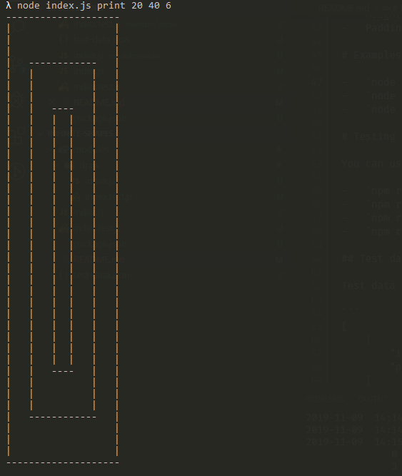
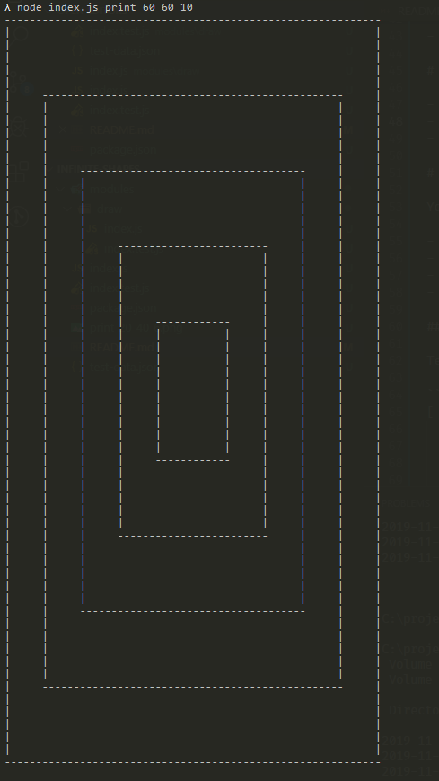
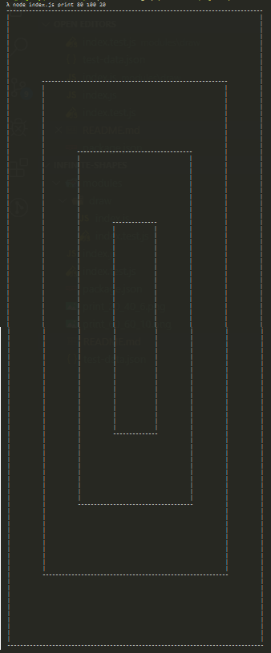

# Infinite loops

# Introduction

Infite loops module makes possible to render infinite rectangles of a given height and width and recursively create inner rectangles of same height - padding and width - padding until there is no space left in the last shape.

# Requirements

Project will work with Node of version 10 or higher. There on other dependencies.

# Setup

-   Install `Node` if needed. Installer is available at https://nodejs.org/en/download/.
-   Open a command line.
-   Clone this repository. Command `git clone https://github.com/CodeVoyager/infinite-shapes.git`
-   `cd infinite-shapes`

# Usage

This module can be used as a required module or from command line.

## Required module

Module can be treated as just another module existing on your device's hard drive. It can be required like any other module with `const infiniteLoops = require('<relative_path>/infinite-loops')`.

Module exports methods:

-   `draw(width: number, height: number, padding: number): number[][]` - Infite loop represented with an array of arrays of numbers
-   `drawToString(arr: number[][]): string` - Result of draw method represented as string. Characters mapped from number to characters. Rows separated with `\n`.
-   `handleRequest({ action: string, width: number, height: number, padding: number }): {isOk: boolean, value: any, err: Error}` - Facade function for module. Accept action name and action parameters and returs Result object. If action is successful `isOk` is true and value is present. Otherwise value is not set and `err` attribute contains reason of failure.

## Standalone command line tool

Available actions are:

-   `node index.js draw <width> <height> <padding>` - Infite loop represented with an array of arrays of numbers
-   `node index.js print <width> <height> <padding>` - Infite loop represented as string.

## Inputs requirements

-   Width should be even and >=20
-   Height should be even and >=20
-   Padding should be even and >=4

# Examples

-   `node index.js print 20 40 6` <br/>

-   `node index.js print 60 60 10` <br/>

-   `node index.js print 80 100 20` <br/>


# Testing

You can use npm scripts below to run tests

-   `npm run test` - Runs all test
-   `npm run test:index` - Runs test for index module
-   `npm run test:draw` - Runs test for draw module
-   `npm run test:draw -- <path_to_test_cases/file.json>` - Runs test for draw module with user defined test data.

## Test data format

Test data should be file with JSON standard compliant content. Data format:

```
[
    {
        "input": "<width>,<height>,<padding>", // input
        "pixelArrayJson": "[[0, 0, 0]]", // number[][] passed into JSON.stringify
    }
]
```

# Big O

## Space complexity

Space complexity is O(N + M) where N and M are dimensions of outer rectangle

## Time complexity

Time complexity is O(n)

# Notes

Goal of this project is to be have as little dendecies as possible. Testing and some API elements are therefore simplified.
